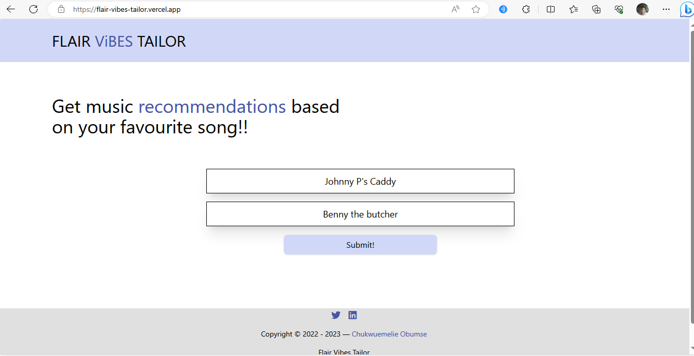
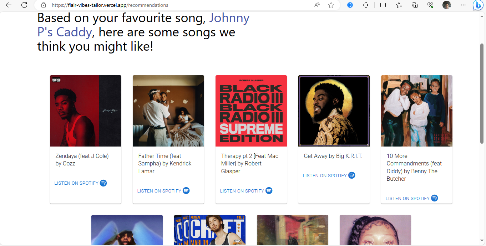

# Vibes Tailor V2 -  Music Recommender
A web application that allows you to submit your favorite song and get recommended songs that match your taste in music.

The Vibes Tailor is a music recommender I created for music enthusiasts who are looking for new music to listen to, and individuals who might have gotten tired of their music rotations (libraries and playlists). The music recommender requires the user to put in their favourite song, and then based on that song, it generates recommendations of songs they might like based on similarity of specific audio features like danceability, key (important because people often prefer certain keys in music, and it can affect the emotional response to a song), and tempo of the song submitted. 

As someone who loves music, I've always been interested in the idea of creating a music recommendation system. So, when I reached the final phase of my ALX Africa/Holberton School software engineering foundations sprint where I was required to build a portfolio project, I decided to take go down the path of finally creating my own music recommender.

Link to the deployed product - <a href="https://vibes-tailor.vercel.app" target="_blank">Click Me</a>

# Prerequisites
- Node.js
- Tailwind CSS
- React

# Built With
- <a href="https://nodejs.org/en" target="_blank">Node.js</a> - The server-side runtime environment
- <a href="https://tailwindcss.com/" target="_blank">Tailwind CSS</a> - This is a utility-first CSS framework used for simplifying the responsive web design process.
- <a href="https://react.dev/" target="_blank">React</a> - The project is built using the React JavaScript library, providing a robust and efficient front-end framework for dynamic rendering.
- <a href="https://developer.spotify.com/" target="_blank">Spotify's api</a> - Used to explore audio features and audio analysis of tracks

# Data Source
The track details, audio features, and recommendations used in this project are provided by Spotify and harnessed through the Spotify API.

# Getting Started
1. Clone the repository:

   `git clone https://github.com/JasonFlair/Flair_Vibes_Tailor_V2`
2. Change into the server-side of the directory:

   `cd Flair_Vibes_Tailor_V2/node-app`

3. Install the required packages:

  `npm install`

4. Run the Node.js application for the api:

   `CLIENT_ID='your_spotify_clientid' CLIENT_SECRET='your_spotify_clientsecret' nodemon app.js`

# How the product works
<h3>Step 1: Put In Your Favourite Song's Details</h3>
          
Put in the song you can't get enough of right now as well as the artiste who made the song.

          
<h3>Step 2: Hit The Submit button to Get Personalized Recommendations</h3>
          
FVT will use Spotify's trusted API with carefully selected paramters to generate songs tailored just for you.

<h3>Step 3: Listen and Enjoy</h3>
          
Check out the songs recommended and discover your new favourite artiste(s) or song(s)!.

            <figure>
              
              <figcaption>Recommendations is generated and rendered on screen for you.</figcaption>
            </figure>

# Development
Coding for the music recommender project began on February 10th and is still on going as I'm always looking for ways to improve the application and provide better recommendations for users.
        <figure>
            
            <figcaption>Trello board of the Flair Vibes Tailor Minimum Viable Product, as at the 20th of February.</figcaption>
        </figure>

# Technical Challenge During Development 
While developing the Flair Vibes Tailor, I discovered that creating and maintaining a large music dataset which would have tons of songs with different audio features to be used for generating recommendations, was not practical for me as doing so was beyond my means and that it would be more efficient to use a live dataset that updates in real-time. Due to the fact that I had no knowledge of data science prior to development of the flair vibes tailor, I struggled with using any filtering technique like alternating least squares. This prompted me to find other solutions and I decided to circumvent the challenges by creating a web application that interacts with Spotify's API. This way, I was able to get a live and well maintained dataset, consisting of all the songs available on Spotify and I had access to their audio features. Using Spotify's API, I also had access to an endpoint that uses a combination of collaborative filtering as well as content-based filtering for recommendations as opposed to solely using collaborative filtering with alternating least squares which I found difficult to implement.

To implement this solution, I had to learn how to interact with the Spotify API and integrate it into the Flair Vibes Tailor. I spent several hours reading through documentation, watching YouTube videos, experimenting with different techniques, and troubleshooting errors. Eventually, I was able to successfully integrate the Spotify API into the application, and the result was a more efficient and accurate recommendation system.

# Author
Chukwuemelie 'Jason Flair' Obumse. Email - emelieobumse100@gmail.com, Twitter handle - <a href="https://twitter.com/wfmjson" target="_blank"> My Twitter</a>

